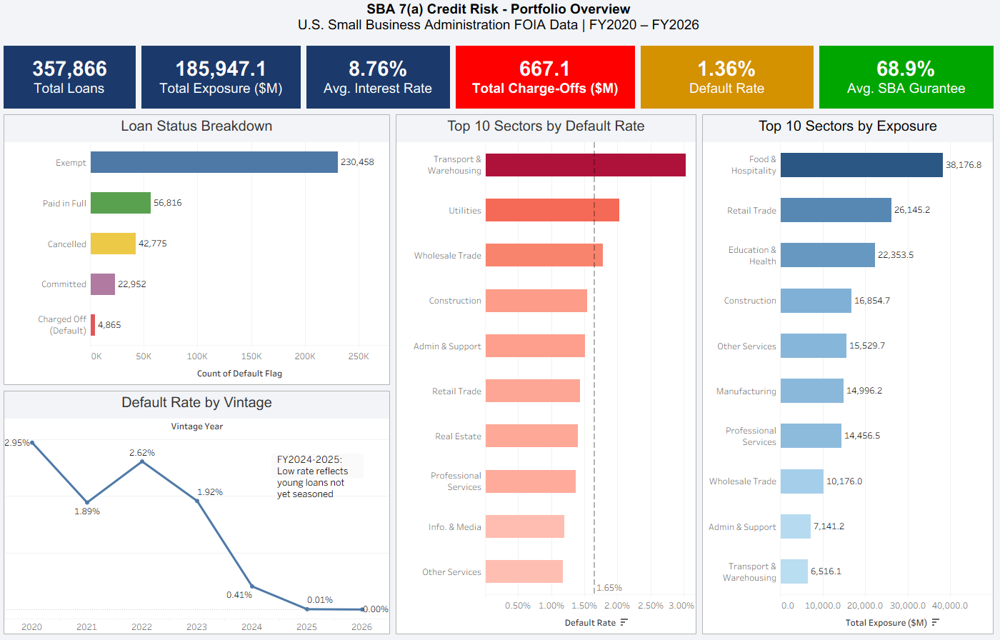
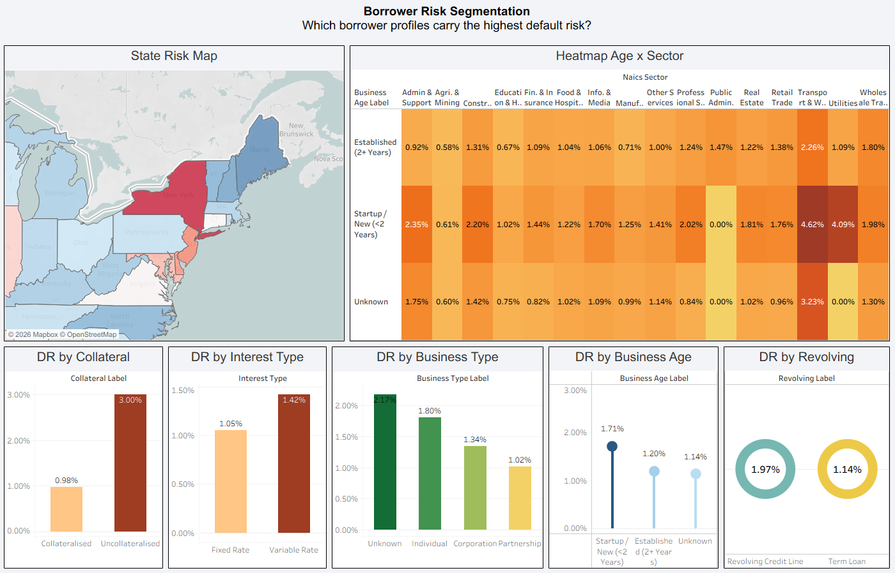
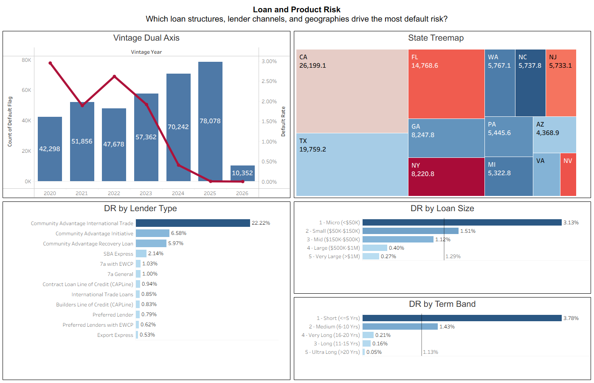
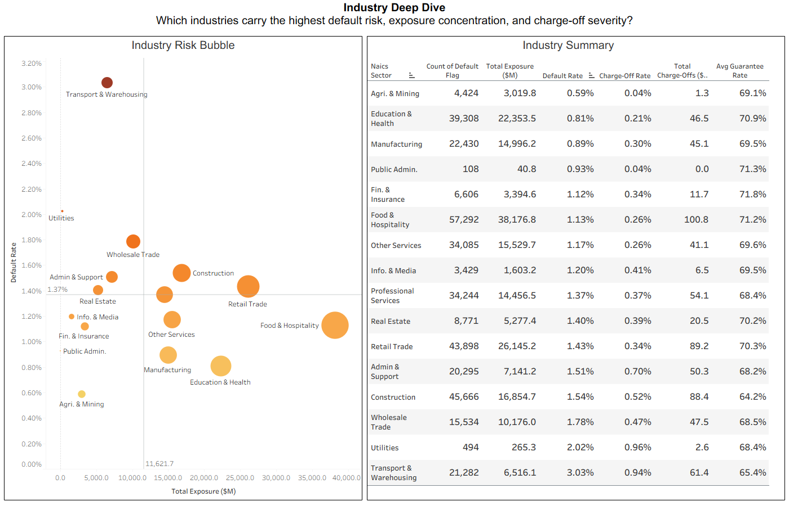
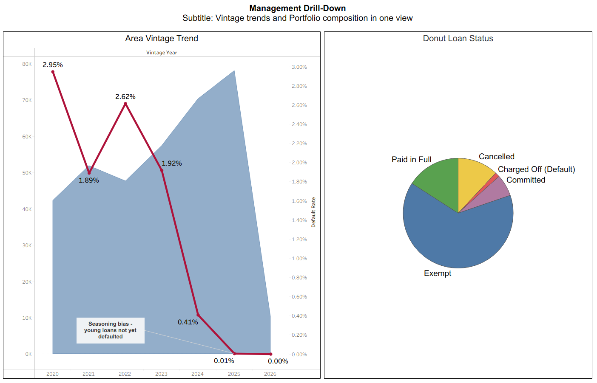

# SBA 7(a) Small Business Credit Risk & Default Monitoring Dashboard

> **Live Dashboard →** [View on Tableau Public](https://public.tableau.com/views/SBA7aCreditRiskAnalysis/SBACreditRisk-FullAnalysis?:language=en-US&:sid=&:redirect=auth&:display_count=n&:origin=viz_share_link)

---

## Project Overview

This project builds a **five dashboard interactive credit risk monitoring system** using real U.S. government loan data from the Small Business Administration (SBA). It mirrors how a bank's credit risk team monitors portfolio health, identifies dangerous segments, and reports to senior management.

The entire pipeline, from raw government data to polished interactive dashboards, was built independently using Python for data engineering and Tableau for visualisation.

| Metric | Value |
|---|---|
| Total Loans Analysed | 357,866 |
| Total Portfolio Exposure | $185.9 Billion |
| Total Charge-Offs (Losses) | $667.1 Million |
| Overall Default Rate | 1.36% |
| Data Coverage | FY2020 – FY2026 |
| Data Source | U.S. SBA FOIA 7(a) - Updated Feb 2026 |

---

## Dashboard Previews

### Dashboard 1: Portfolio Overview
*What is the headline health of the portfolio? Which sectors and vintages drive risk?*



**Key Findings:**
- FY2020 vintage carries the highest default rate at **2.95%**, COVID-era loans that ultimately failed
- FY2022 vintage at **2.62%** reflects the impact of the fastest Fed rate hiking cycle in 40 years
- FY2024–2025 show near zero default rates due to **seasoning bias**, loans are too young to have defaulted yet, but latent risk will surface over 12–18 months
- Transport & Warehousing leads sector default rates at **3.03%** while Food & Hospitality dominates exposure at **$38.2B**

---

### Dashboard 2: Borrower Risk Segmentation
*Which borrower profiles carry the highest default risk?*



**Key Findings:**
- **Uncollateralised loans** default at **3.00%** vs **0.98%** for collateralised, a 3× difference confirming that collateral is one of the strongest risk mitigants
- **Variable rate borrowers** default at **1.42%** vs **1.05%** for fixed rate, the 500 basis point Fed rate hike cycle (2022–2023) directly increased repayment stress
- **Startup businesses** default at **1.71%** vs **1.20%** for established businesses, 43% higher frequency
- The heatmap reveals the most dangerous combination: **Startup businesses in Transport & Warehousing** at **4.62%** default rate

---

### Dashboard 3: Loan and Product Risk
*Which loan structures, lender channels, and geographies drive the most risk?*



**Key Findings:**
- **Micro loans (<$50K)** default at **3.13%**, nearly 12× the rate of Very Large loans (>$1M) at **0.27%**. Larger loans receive more rigorous underwriting and go to more established borrowers
- **Short-term loans (≤5 years)** carry the highest default rate at **3.78%**, often used by distressed businesses as emergency funding
- **California** holds the largest single state exposure at **$26.2B**; **New York** and **Florida** show the highest default rates among top-exposure states, concentration risk hotspots
- The dual axis vintage chart confirms that **FY2020 and FY2022 combined high loan volume with elevated default rates**, a hallmark of looser underwriting during periods of rapid growth

---

### Dashboard 4: Industry Deep Dive
*Which industries are most dangerous, and where is the money most concentrated?*



**Key Findings:**
- **Transport & Warehousing** sits in the danger zone: highest default rate (**3.03%**) and **$61.4M** in charge offs despite modest exposure, thin margins, fuel cost volatility, and supply chain stress drive failures
- **Food & Hospitality** is the largest sector by exposure (**$38.2B**, **57,292 loans**) with a moderate default rate of **1.13%** — high volume concentration with manageable per loan risk
- **Admin & Support Services** shows a disproportionately high charge off rate (**0.70%**) relative to its default rate, meaning when these businesses fail, losses per loan are severe
- The bubble chart quadrant analysis shows **Retail Trade** approaching the high exposure, high default danger zone, worth monitoring closely

---

### Dashboard 5: Management Drill-Down
*Interactive portfolio summary with all filters active simultaneously*



**Key Findings:**
- **64.4%** of the portfolio is currently active (Exempt status), the majority of loans are still in repayment
- Portfolio origination volume is **accelerating**, FY2025 at 78,078 loans is the highest vintage in the dataset
- The donut chart shows only **1.4%** of loans have charged off, but those 4,865 loans represent **$667M** in real losses
- Area chart confirms the inverse relationship between volume and default: years of peak origination do not always coincide with peak default, the lag is 18–36 months

---

## Technical Architecture

```
Raw Data (SBA FOIA CSV, 35MB)
        │
        ▼
Python Preparation Script (sba_prep.py)
   ├── Load 25 of 43 columns (usecols — memory efficient)
   ├── Convert financial text fields to numeric
   ├── Create DEFAULT_FLAG (CHGOFF = 1, all else = 0)
   ├── Engineer 16 category columns:
   │   ├── LOAN_SIZE_BAND, TERM_BAND, RATE_BAND
   │   ├── NAICS_SECTOR (6-digit → 16 major sectors)
   │   ├── BUSINESS_AGE_LABEL, BUSINESS_TYPE_LABEL
   │   ├── INTEREST_TYPE, COLLATERAL_LABEL
   │   ├── CHARGEOFF_RATE_PCT, GUARANTEE_RATE_PCT
   │   └── BANK_RISK_AMOUNT, STATE, LENDER_TYPE
   └── Export sba_dashboard_ready.csv (357,866 rows × 36 cols)
        │
        ▼
Tableau 2026.1 (5 Dashboards + 1 Story)
   ├── 5 Calculated Fields (Default Rate, Exposure $M, etc.)
   ├── 31 Individual Chart Sheets
   ├── 5 Assembled Dashboards
   └── 1 Tableau Story (guided narrative)
        │
        ▼
Tableau Public (live, interactive, publicly accessible)
```

---

## Dataset

**Source:** U.S. Small Business Administration - FOIA 7(a) Loan Performance Data
**URL:** https://data.sba.gov/dataset/7-a-504-foia
**File Used:** `FOIA - 7(a) (FY2020-Present) as of 251231.csv`
**Last Updated:** February 6, 2026
**Licence:** Public Domain (U.S. Government Open Data)

The SBA 7(a) programme is the US government's primary small business loan guarantee scheme. The SBA guarantees 50–90% of each loan made by private banks, reducing lender risk while expanding credit access to small businesses. This dataset covers all 7(a) loans from FY2020 through Q4 FY2025, spanning COVID-19, post-pandemic recovery, and the 2022–2023 Federal Reserve rate hiking cycle.

**No data download required to view the dashboard**, the Tableau Public link above is fully interactive.

---

## Key Credit Risk Concepts Used

| Concept | Application in This Project |
|---|---|
| **PD (Probability of Default)** | Default Rate = SUM(DEFAULT_FLAG) / COUNT(loans) per segment |
| **LGD (Loss Given Default)** | Charge-Off Rate = grosschargeoffamount / grossapproval |
| **EAD (Exposure at Default)** | Total Exposure = SUM(grossapproval) |
| **Expected Loss** | EL ≈ Default Rate × Charge Off Rate × Exposure - visualised per sector |
| **Vintage Analysis** | Default rate tracked by fiscal year of origination (FY2020–FY2026) |
| **Concentration Risk** | Geographic (state treemap) and industry (bubble chart) concentration |
| **Seasoning Bias** | FY2024–2025 low default rates explained by loan age, not loan quality |
| **SBA Guarantee** | GUARANTEE_RATE_PCT shows government vs bank risk sharing per loan |

---

## How to Reproduce

### Requirements
```
Python 3.8+
pandas
Tableau Desktop 2026.1 (or Tableau Public Desktop)
```

### Step 1 - Download the Data
1. Go to https://data.sba.gov/dataset/7-a-504-foia
2. Download `FOIA - 7(a) (FY2020-Present) asof 251231.csv`
3. Place it in the same folder as `sba_prep.py`

### Step 2 - Run the Preparation Script
```bash
python sba_prep.py
```

The script will print a full summary report and save `sba_dashboard_ready.csv` in the same folder. Expected output:
```
Total loans    : 357,866
Default Rate   : 1.36%
Total Exposure : $185.95B
Total Losses   : $667.1M
```

### Step 3 - Connect to Tableau
1. Open Tableau Desktop
2. Connect → Text File → select `sba_dashboard_ready.csv`
3. Verify numeric columns: `grossapproval`, `DEFAULT_FLAG`, `initialinterestrate`, `terminmonths`
4. Create 5 calculated fields (see script comments for formulas)
5. Build dashboards following the sheet structure in `/screenshots`

---

## Project Structure

```
sba-credit-risk-dashboard/
│
├── sba_prep.py                    # Python data preparation pipeline
├── README.md                      # This file
│
└── screenshots/
    ├── 01_portfolio_overview.PNG
    ├── 02_borrower_risk_segmentation.PNG
    ├── 03_load_and_product_risk.PNG
    ├── 04_industry_deepdive.PNG
    └── 05_management_drill-down.PNG
```

---

## Author

**Prathik**
M.Sc. Data Science - Symbiosis University


---

*Data source: U.S. Small Business Administration FOIA 7(a) Dataset. All analysis is based on publicly available government data.*
